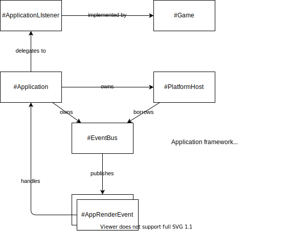
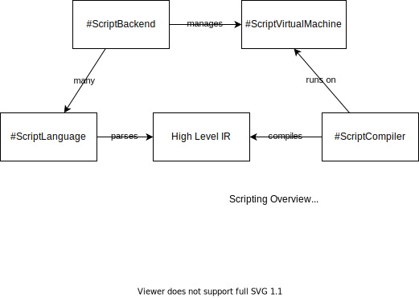

# Surreal 

A sweet little game engine built with Rust.

This project is in active development.

## Design goals

### Modern and performant 2d rendering

Some example features:
* Easy to use OpenGL bindings with support for advanced shader programs.
* Real-time lighting and shadowing.
* Smooth interpolated pixel snapping
* SDF generation for advanced screen space effects (such as ray marching)
* Global illumination based on 2d voxel projection planes

Whilst 3d rendering is not a goal of the project, it's of course possible with some tweaks to the core pipelines. The intent however is to not introduce rendering complexity by implying structure about lighting, shadowing, model management, bone management, etc.

### Pluggable and flexible scripting

Writing games is hard, writing games in a highly rigid language like C/C++/Rust/etc is even harder.

Scripting allows for DSL to take the brunt of the work required in game development. DSLs can be used for all sorts of scenarios:

* Dialogue
* Coordination
* Blueprints/Procedural generation
* Behaviour trees
* State machines
* Game events and scripting

A goal of this project is to implement a shared virtual machine for executable scripts and offer a variety of different front-ends for different scripting languages; the goal is to allow the best tool for the job.

Metadata about scripts can also be provided for reflection, dynamic code generation, etc, allowing different DSLs for different use cases.

## Architecture

### Application framework

The application framework is the entry point for the system, with a centralized event bus for forwarding events out of the underlying platform and vice versa.

 

### Scripting framework

The scripting framework provides a central stack-based virtual machine which executes compiled script bytecode. Bytecode is produced from either a shared Intermediate Representation (IR) or from manually emitted instructions in an individual language.

