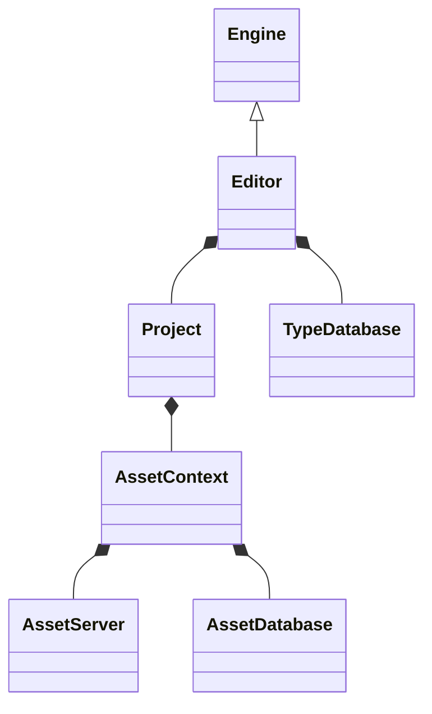

# Editor Architecture

This is an overview of the Surreal editor architecture.

Things to think about:

- [ ] How to serialize editor state?
- [ ] How to hot-reload the application binary?
- [ ] How to get types and assets registered and managed
- [ ] How to build binary artifacts and swap between edit-time and run-time
- [ ] How to build a user interface for editing games? (UI Toolkit)

## Ideas

